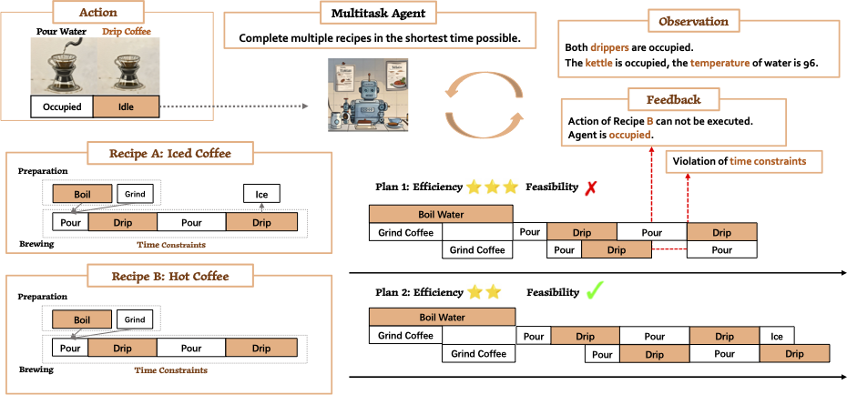

# Recipe2Plan
Existing evaluation benchmarks tend to overemphasize **single-task** performance, with insufficient attention given to the crucial aspects of **multitask planning** and **execution efficiency** required in real-world scenarios. 

Recipe2Plan challenges agents to optimize cooking time through parallel task execution while respecting **temporal constraints** i.e. specific actions need to be performed within a particular time intervals following the preceding steps.



Overly aggressive local parallelization may disrupt this constraint, potentially compromising the entire cooking process. Extensive experiments in [our paper](https://arxiv.org/abs/2503.02238) reveal challenges in maintaining this balance between efficiency and feasibility. 

## Installation
```
pip install requirements.txt
```
And set your api keys in `.bashrc` as specified in `evaluation/model.py`

## Evaluation
```
python plan_solve_agent.py \
    --model_name claude-opus-4-20250514 \
    --verbose \
    --oracle \
    --level easy
```
Note: We use `level=easy` and `level=medium` to indicate planning `w/o time constraints` and `w/ time constraints`.

You can run a result summarizer as 
```
python result_summarizer.py --level easy
python result_summarizer.py --level medium
```
